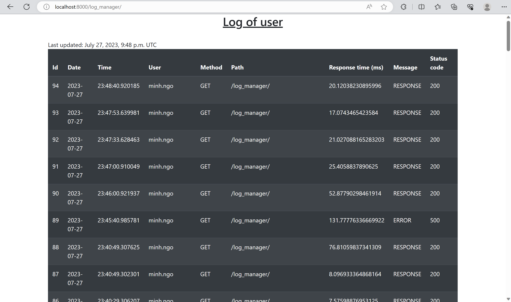

# SMART 2024 (backend)


Students: **[To be assigned]**

### Abstract
This is the backend for the SMART-project at INSA Lyon there the objective is to create game-elements for different HEXAD-player types as well as an algorithm that is going to introduce game-elements to a user based on their main HEXAD-12 type as well as their motivation-score using the SDI.

## Description 
This is the app from the project __Adaptive and Privacy-Aware Persuasive Strategy for behavior change (APAPS)__ team DRIM, funded by [LIRIS laboratory](https://liris.cnrs.fr/), [INSA Lyon](https://www.insa-lyon.fr/) and partner [University of Passau](https://www.uni-passau.de/en/).

## Project Goal

## Requirements
Python 3.6 or higher \
Django 2.2 or higher \
Django Rest Framework 3.11 or higher \
PostgreSQL 12.2 or higher
Docker

### Installation
1. Clone the repository
2. Install the requirements
3. Run the server
4. Go to http://localhost:8000/doc/ to see the documentation
5. Enjoy!

### Launch the application for the first time with Docker
1. Run ```docker compose up``` at the root of the repository.
2. You should have 2 Docker containers running: sustain-dev-db (Postgres container) and sustain-dev-api (API container).
3. Then, open a new command prompt and execute ```docker exec -it sustain-dev-api sh``` to acces to a Shell for the API container.
4. Within this Shell, execute the two following commands:
    ```python3 manage.py migrate``` (for M1 chips on mac)

    ```python manage.py migrate```

    ```python manage.py createsuperuser``` -> you will prompted a username and password to create a super user for the application.
5. The backend should now work properly.

## Material

### API Endpoints
http://{host}/api/v1

#### User
| Method | Endpoint     | Permissions | Description       |
| ------ |--------------|-------------|-------------------|
| GET | /users/      | Admin       | Get all users     |
| GET | /users/{id}/ | User        | Get user by id    |
| POST | /users/add/  | Admin       | Create new user   |
| PUT | /users/{id}/ | User, Admin | Update user by id |
| DELETE | /users/{id}/ | User, Admin | Delete user by id |

#### User Profile
| Method | Endpoint              | Permissions      | Description       |
| ------ |-----------------------|------------------|-------------------|
| GET | /users/profiles/{id}/ | User him/herself | Get profile by id    |
| POST | /users/profiles/      | User him/herself   | Create new profile   |
| PUT | /users/profiles/{id}/ | User him/herself | Update profile by id |
| DELETE | /users/profiles/{id}/ | User him/herself | Delete profile by id |

#### Authentication
| Method | Endpoint              | Permissions | Description       |
| ------ |-----------------------|-------------|-------------------|
| POST | /auth/login/ |             | Login |

#### Gamification Type
| Method | Endpoint                  | Permissions | Description                                                             |
|--------|---------------------------|-------------|-------------------------------------------------------------------------|
| GET    | /gamification-types/      | Admin, User | Get all types                                                    |
| GET    | /gamification-types/{id}/ | Admin, User | Get type by id                                                   |
| POST   | /gamification-types/      | Admin       | Create new type                                                  |
| PUT    | /gamification-types/{id}/ | Admin       | Update type by id                                                |
| DELETE | /gamification-types/{id}/ | Admin       | Delete type by id                                                |

#### Gamification Profile
| Method | Endpoint                          | Permissions | Description                      |
|--------|-----------------------------------|-------------|----------------------------------|
| POST   | /gamification-profiles/questions/ | User        | Answer 12 Hexad questions        |
| GET    | /gamification-profiles/profiles/  | User        | Get score for gamification types |

#### Gamification Question
| Method | Endpoint                          | Permissions    | Description                      |
|--------|-----------------------------------|----------------|----------------------------------|
| GET    | /gamification-questions/          | Admin, User | Get all questions                |
| POST   | /gamification-questions/          | Admin          | Create new question              |
| PUT    | /gamification-questions/{id}/     | Admin          | Update question by id            |
| DELETE | /gamification-questions/{id}/     | Admin          | Delete question by id            |
| GET    | /gamification-questions/{id}/     | Admin, User | Get question by id               |

#### Motivation
| Method | Endpoint        | Permissions    | Description                                 |
|--------|-----------------|----------------|---------------------------------------------|
| GET    | /motivations/ | Admin, User    | Get all motivations                         |
| GET    | /motivations/{id}/ | Admin, User    | Get motivation by id                        |
| POST   | /motivations/ | Admin          | Create new motivation                       |
| PUT    | /motivations/{id}/ | Admin          | Update motivation by id                     |
| DELETE | /motivations/{id}/ | Admin          | Delete motivation by id                     |

#### Motivation Profile
| Method | Endpoint                        | Permissions | Description                    |
|--------|---------------------------------|---------|--------------------------------|
| POST   | /motivation-profiles/questions/ | User    | Answer 24 motivation questions |
| GET    | /motivation-profiles/profiles/  | User    | Get score for motivations      |

#### Motivation Question
| Method | Endpoint        | Permissions    | Description                                 |
|--------|-----------------|----------------|---------------------------------------------|
| GET    | /motivation-questions/ | Admin, User    | Get all questions                           |
| GET    | /motivation-questions/{id}/ | Admin, User    | Get question by id                          |
| POST   | /motivation-questions/ | Admin          | Create new question                         |
| PUT    | /motivation-questions/{id}/ | Admin          | Update question by id                       |
| DELETE | /motivation-questions/{id}/ | Admin          | Delete question by id                       |

#### User Achievement
| Method | Endpoint        | Permissions    | Description                                                                           |
|--------|-----------------|----------------|---------------------------------------------------------------------------------------|
| GET    | /achievements/ | Admin, User    | Get all achievements                                                                  |
| GET    | /achievements/{id}/ | Admin, User    | Get achievement by id                                                                 |
| POST   | /achievements/ | Admin          | Create new achievement                                                                |
| PUT    | /achievements/{id}/ | Admin          | Update achievement by id                                                              |
| DELETE | /achievements/{id}/ | Admin          | Delete achievement by id                                                              |
| GET    | /achievements/user/ | User           | Get all achievements of user                                                          |
| POST   | /achievements/list/user/ | User           | New achievements for user                                                             |
| DELETE | /achievements/list/user/{id}/ | User           | Delete achievement of user by id                                                      |
| GET    | /achievements/ranking/ | Authentication | Ranking of users who have <br /> the most achievements                                |
| GET    | /achievements/ranking/date/{id}/ | Authentication | Ranking of users who achieve <br /> the given achievement in the <br /> earliest time |

#### Badge
| Method | Endpoint        | Permissions    | Description                                 |
|--------|-----------------|----------------|---------------------------------------------|
| GET    | /badges/        | Admin, User    | Get all badges                              |
| GET    | /badges/{id}/   | Admin, User    | Get badge by id                             |
| POST   | /badges/        | Admin          | Create new badge                            |
| PUT    | /badges/{id}/   | Admin          | Update badge by id                          |
| DELETE | /badges/{id}/   | Admin          | Delete badge by id                          |
| GET | /badges/earned/ | User           | Get all badges of user                      |
| POST | /badges/user/  | User           | Add new badge of user                       |
| DELETE | /badges/user/{id}/ | User           | Delete badge of user by id                  |

### How to answer the questions
Each score is from 1 to 7
- 1: Strongly disagree
- 2: Disagree
- 3: Somewhat disagree
- 4: Neutral
- 5: Somewhat agree
- 6: Agree
- 7: Strongly agree
#### Hexad Question
__Philanthropist__ \
Q1. Rewards are a great way to motivate me \
Q2. It is important to me to follow my own path \
__Socializer__ \
Q3. It makes me happy if I am able to help others \
Q4. I dislike following rules \
__Free Spirit__ \
Q5. I see myself as a rebel \
Q6. I like to be in control of my own destiny \
__Achiever__ \
Q7. I like mastering difficult tasks \
Q8. I enjoy emerging victorious out of difficult circumstances \
__Disruptor__ \
Q9. The well-being of others is important to me \
Q10. I enjoy group activities \
__Player__ \
Q11. Being independent is important to me \
Q12. I like being part of a team

- POST request to `api/v1/gamification-profiles/questions/` with body:
```json
{
    "data": [
        {"question_id": 1, "score": 5},
        {"question_id": 2, "score": 5},
        {"question_id": 3, "score": 5},
        {"question_id": 4, "score": 5},
        {"question_id": 5, "score": 5},
        {"question_id": 6, "score": 6},
        {"question_id": 7, "score": 5},
        {"question_id": 8, "score": 5},
        {"question_id": 9, "score": 5},
        {"question_id": 10, "score": 5},
        {"question_id": 11, "score": 5},
        {"question_id": 12, "score": 5}
    ]
}
```

- GET request to `api/v1/gamification-profiles/profiles/?profile_id=1` with parameter `profile_id`. The sample result is:
```json
[
    {
        "name": "Philanthropist",
        "description": "Philanthropists are people who engage in philanthropy; that is, they donate their time, money, and/or reputation to charitable causes. Philanthropy is a combination of two Greek words, philos, meaning love, and anthropos, meaning human beings, thus philanthropy is giving love for humanity.",
        "score": 10
    },
    {
        "name": "Socializer",
        "description": "Socializers are people who engage in socialization; that is, they interact with other people. Socialization is a combination of two Greek words, social, meaning companionship, and ization, meaning the process of making. Thus, socialization is the process of making companionship.",
        "score": 10
    },
    {
        "name": "Free Spirit",
        "description": "Free Spirits are people who engage in free spirit; that is, they are free from society. Free spirit is a combination of two Greek words, free, meaning freedom, and spirit, meaning soul, thus free spirit is the freedom of the soul.",
        "score": 10
    },
    {
        "name": "Achiever",
        "description": "Achievers are people who engage in achievement; that is, they accomplish goals. Achievement is a combination of two Greek words, achieve, meaning to accomplish, and ment, meaning the result of, thus achievement is the result of accomplishing.",
        "score": 10
    },
    {
        "name": "Disruptor",
        "description": "Disruptors are people who engage in disruption; that is, they interrupt the normal course. Disruption is a combination of two Greek words, dis, meaning not, and rupt, meaning break, thus disruption is the act of not breaking.",
        "score": 10
    },
    {
        "name": "Player",
        "description": "Players are people who engage in play; that is, they have fun. Play is a combination of two Greek words, ple, meaning pleasure, and ay, meaning the act of, thus play is the act of pleasure.",
        "score": 10
    }
]
```

#### Motivation Question
__Intrinsic Motivation__ \
Q1. It is fun to create meals that are good for my health \
Q2. I like to find new ways to create meals that are good for my health \
Q3. I take pleasure in fixing healthy meals \
Q4. For the satisfaction of eating healthy \
__Integrated Regulation__ \
Q5. Eating healthy is an integral part of my life \
Q6. Eating healthy is part of the way I have chosen to live my life \
Q7. Regulating my eating behaviors has become a fundamental part of who I am \
Q8. Eating healthy is congruent with other important aspects of my life \
__Identified Regulation__ \
Q9. I believe it will eventually allow me to feel better \
Q10. I believe it’s a good thing I can do to feel better about myself in general \
Q11. It is a good idea to try to regulate my eating behaviors \
Q12. It is a way to ensure long-term health benefits \
__Introjected Regulation__ \
Q13. I don’t want to be ashamed of how I look \
Q14. I feel I must absolutely be thin \
Q15. I would feel ashamed of myself if I was not eating healthy \
Q16. I would be humiliated I was not in control of my eating behaviors \
__External Regulation__ \
Q17. Other people close to me insist that I do \
Q18. Other people close to me will be upset if I don’t' \
Q19. People around me nag me to do it \
Q20. It is expected of me \
__Amotivation__ \
Q21. I don’t really know. I truly have the impression that I’m wasting my time trying to regulate my eating behaviors \
Q22. I don’t know why I bother \
Q23. I can’t really see what I’m getting out of it \
Q24. I don’t know. I can’t see how my efforts to eat healthy are helping my health situation

- POST request to `api/v1/motivation-profiles/questions/` with body:
```json
{
    "data": [
        {"question_id": 1, "score": 5},
        {"question_id": 2, "score": 3},
        {"question_id": 3, "score": 5},
        {"question_id": 4, "score": 7},
        {"question_id": 5, "score": 5},
        {"question_id": 6, "score": 6},
        {"question_id": 7, "score": 7},
        {"question_id": 8, "score": 3},
        {"question_id": 9, "score": 2},
        {"question_id": 10, "score": 1},
        {"question_id": 11, "score": 4},
        {"question_id": 12, "score": 6},
        {"question_id": 13, "score": 3},
        {"question_id": 14, "score": 2},
        {"question_id": 15, "score": 5},
        {"question_id": 16, "score": 1},
        {"question_id": 17, "score": 1},
        {"question_id": 18, "score": 1},
        {"question_id": 19, "score": 6},
        {"question_id": 20, "score": 7},
        {"question_id": 21, "score": 5},
        {"question_id": 22, "score": 4},
        {"question_id": 23, "score": 3},
        {"question_id": 24, "score": 2}
    ]
}
```

- GET request to `api/v1/motivation-profiles/profiles/?profile_id=2` with parameter `profile_id`. The sample result is:
```json
[
    {
        "name": "Intrinsic motivation",
        "score": 5.0
    },
    {
        "name": "Integrated regulation",
        "score": 5.25
    },
    {
        "name": "Identified regulation",
        "score": 3.25
    },
    {
        "name": "Introjected regulation",
        "score": 2.75
    },
    {
        "name": "External regulation",
        "score": 3.75
    },
    {
        "name": "Amotivation",
        "score": 3.5
    }
]
```

### Log management view
- Authorization: Admin
- Endpoint: `log_manager/`
- If you want to see all logs, navigate to this endpoint.

- If you want to see logs of a specific user, navigate to this endpoint with parameter `user`.


## Note for Students

* Add your name and surname into the Readme file and your teammates as collaborators
* Complete the field above after project is approved
* Make any changes to your repository according to the specific assignment;
* Ensure code reproducibility and instructions on how to replicate the results;
